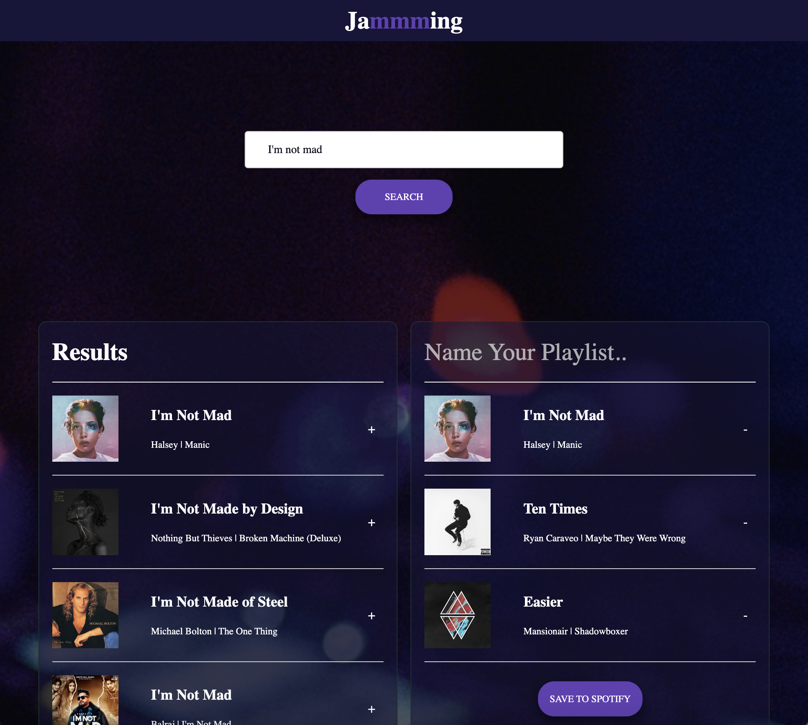

# 🎵 Jammming App 🎵
The Jammming App is a web application that allows users to search for songs, create playlists, and save them to their Spotify account.

 

## Features 

🔍 Search songs: Enter a song name in the search bar to find matching tracks on Spotify.  

➕ Add songs to playlist: Browse through the search results and add your favorite songs to your playlist.  

❌ Remove songs from playlist: remove unwanted songs from your playlist with a simple click.  

💾 Save playlist to Spotify: Give your playlist a name and save it directly to your Spotify account.  

🌟 Visual feedback: Receive success or error messages upon saving your playlist.  

## Technologies Used

⚛️  React: JavaScript library for building the user interface.  

🎵 Spotify API: Allows access to the Spotify music catalog and user account data.  

🚀 SweetAlert: JavaScript library for customizable and responsive alert messages.   

🎨 CSS Modules: CSS scoping and modularization technique for styling components.   

## Installation
1. Clone the repository: git clone <repository-url>
2. Navigate to the project directory: cd jamming-app
3. Install dependencies: npm install   

## Usage
1. Obtain a Spotify API key by creating an app on the Spotify Developer Dashboard.
2. Create a .env file in the project root directory and add your Spotify API key to src/utils/authorization.js
3. Start the development server: npm start
4. Open the app in your browser: http://localhost:3000 (make sure to use the same redirect link on spotify)
